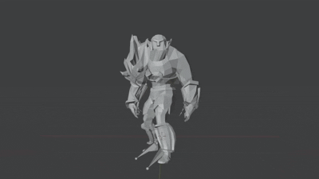

# jittor---jittor_comp_human
Jittor人工智能算法挑战赛人体骨骼生成赛题B榜



## 简介

将三维网格绑定一套骨骼与蒙皮权重以达到驱动网格的目的。使用三维深度神经网络结构，预测三维人体网络架构相对应的骨骼节点的空间位置以及对应的蒙皮权重。

## 安装 

本项目可在 1 张 4090 上训练和推理。

#### 运行环境
- ubuntu 22.04 
- python >= 3.11
- jittor >= 1.3.9.14

#### 安装依赖
执行以下命令构建conda环境
```
conda env create -f environment.yml
```

#### 预训练模型
预训练模型模型在根目录下checkpoints文件夹中

## 数据预处理
https://cloud.tsinghua.edu.cn/f/a0e48edfe8834c7b8b4c/?dl=1
将数据下载解压到 `<root>/code/` 下，并将`<root>/code/`下的所有txt文件剪切到`<root>/code/data`文件夹下

## 训练
第一步：
```
bash code/launch/train_skeleton_mixamo.sh
```
训练2000epoch得到 baseline 对mixamo的骨架预测模型
    
第二步：
```
bash code/launch/train_skeleton_vroid.sh
```
训练2000epoch得到 baseline 对vroid的骨架预测模型
    
第三步：
```
bash code/launch/train_skin_AT.sh
```
训练蒙皮权重预测模型400轮得到预测A/T pose的蒙皮权重模型

第四步：
```
bash code/launch/train_skeleton_pose.sh
```
训练2000epoch得到 baseline 对任意动作的骨架预测模型

第五步：
```
bash code/launch/train_skeleton_regular.sh
```
加入全身骨骼长度和手部骨骼方向的正则项对任意动作的骨架预测模型进行后训练，2000轮。
    

## 推理

依次执行：
```
predict_skeleton_mixamo.sh  # 预测mixamo骨架
predict_skeleton_vroid.sh   # 预测vroid骨架
predict_skeleton_pose.sh    # 预测任意动作骨架
predict_skin_AT.sh          # 预测A/T pose蒙皮权重
```

## 致谢

此项目基于论文 *PCT：Point Cloud Transformer* 和 *One Model to Rig Them All: Diverse Skeleton Rigging with UniRig* 实现。
